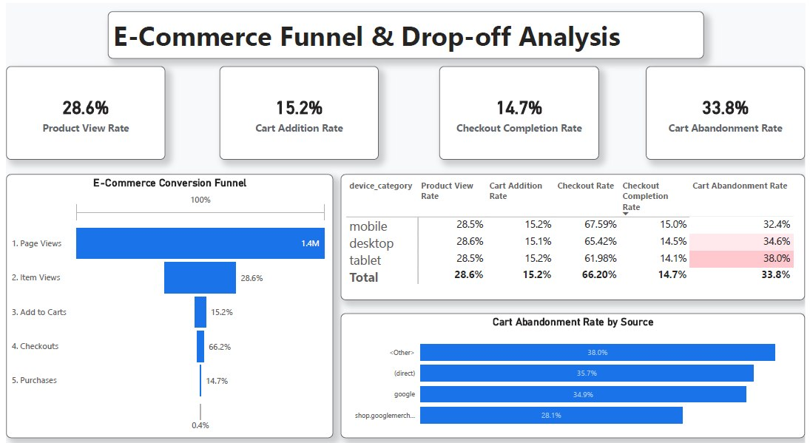
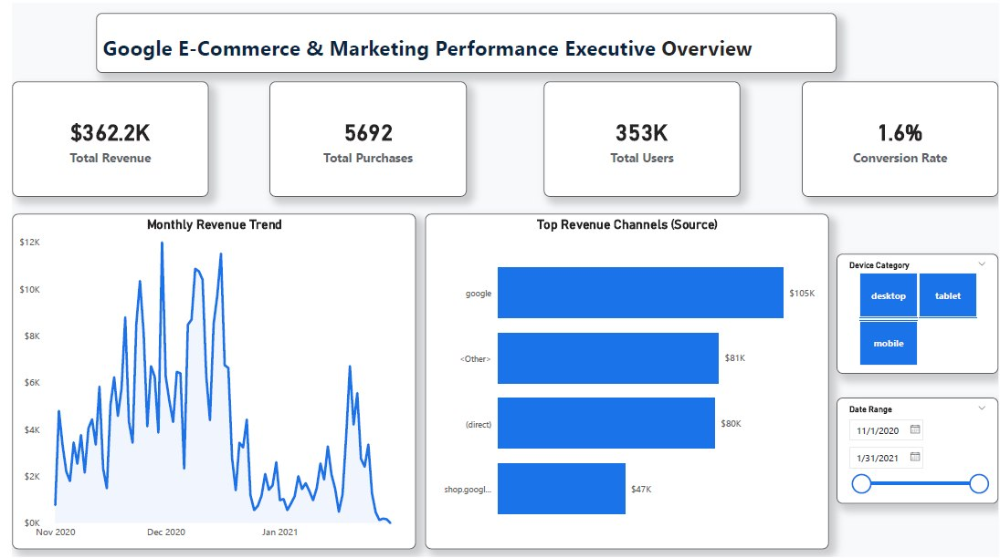

# GA4-Ecommerce-Funnel-Analysis
# 📊 Google E-Commerce Funnel & Marketing Analytics Dashboard

An end-to-end e-commerce analytics project built using **GA4 obfuscated sample dataset via BigQuery** and visualized in **Power BI**. This dashboard bridges marketing acquisition channels with on-site user behavior to identify drop-off points, conversion bottlenecks, and revenue opportunities.

---

## 🖥️ Dashboard Preview

### 1. Executive Overview

### 2. Funnel Analysis

---

## 📌 Project Overview

This project was built to answer two critical questions for any E-Commerce business:
1. **Where is the marketing revenue coming from?**
2. **Where are we losing customers throughout the buying journey?**

By analyzing **350K+ sessions**, this dashboard tracks the full user funnel from landing pages down to final checkout completions.

---

## 📊 Executive Summary & Key Metrics

* 💰 **Total Revenue:** $362.2K
* 🛒 **Total Purchases:** 5,692
* 👥 **Total Users:** 353K
* 📈 **Overall Conversion Rate:** 1.61%

---

## 🔍 Key Insights & Findings

### 1️⃣ Google is the Primary Revenue Driver
* **Google (Organic + Paid)** generated over **$105K** in total revenue, followed by **Direct** traffic ($80K+).
* **Homepage Bottleneck:** Only **28%** of total visitors navigate from the homepage to product view pages, meaning **~71% of users leave before exploring products**.

### 2️⃣ Cart Abandonment & Checkout Drop-off
* **33.8%** of users who add items to their cart leave without completing a purchase.
* Since these users demonstrated high purchase intent, this indicates friction during the final checkout stage.

### 3️⃣ Device Performance Disparity
* **Tablet Users:** Experience the highest cart abandonment rate (**38.0%**) and lowest checkout completion rate (**14.07%**).
* **Mobile Users:** Show the most balanced funnel performance and highest overall conversion success.

---

## 💡 Strategic Solutions & Actionable Business Impact

> *"Data tells us where the problem is. Customer insights help us understand why it happens."*

### 🔹 1. Reducing Checkout Friction
* **Payment Diversity:** Introduce local e-wallets, credit card options, and **Cash on Delivery (COD)** for lower-trust segments.
* **BNPL Options:** Integrate Buy Now Pay Later services (e.g., Tabby, ValU) to reduce high-AOV cart abandonment.
* **Cost Transparency:** Display shipping fees early in the cart process to prevent unexpected drop-offs.

### 🔹 2. Marketing Channel Optimization
* Instead of cutting underperforming channels, evaluate whether the root cause is **audience targeting**, **ad copy mismatch**, or **landing page relevance**.

### 🔹 3. UI/UX & Conversion Rate Optimization (CRO)
* Fix layout and checkout responsiveness for **Tablet** users.
* Improve homepage layout to guide visitors toward featured product categories. 
* *Impact Goal:* Increasing the homepage-to-product-page rate from **28% to 40%** directly increases potential revenue without extra ad spend.

---

## 🛠️ Tech Stack & Tools

* **Data Source:** Google Analytics 4 (GA4) Sample E-Commerce Dataset
* **Querying & ETL:** Google BigQuery (SQL)
* **Data Visualizations:** Power BI Desktop (DAX Measures, Matrix Custom Formatting, Custom Funnel Charts)

---

## 👤 Author

* **Omar Zayan** - Data Analyst
* **GitHub:** [@zayanomar5](https://github.com/zayanomar5)
